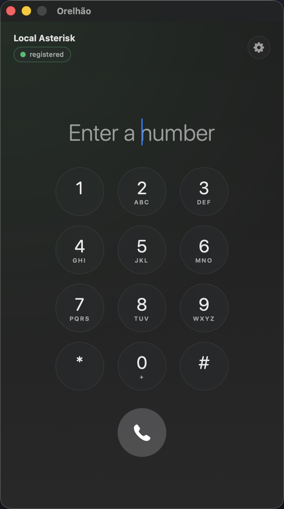

<p align="center">
  
</p>

<h1 align="center">Orelhão</h1>

<p align="center">
  <b>A native macOS SIP softphone — the MicroSIP of the Mac.</b><br/>
  PJSIP 2.17 engine · Objective-C++ bridge · modern SwiftUI interface
</p>

<p align="center">
  <a href="LICENSE"></a>
  
  
  
</p>

<p align="center">
  
</p>

---

*"Orelhão"* (big ear) is what Brazilians call the iconic dome-shaped public payphone.
This is its spiritual successor: a tiny, native, open-source SIP phone for your Mac.

[MicroSIP](https://www.microsip.org/) has been the go-to lightweight softphone on
Windows for a decade — but it's Win32/MFC and will never run on macOS. Orelhão is
built on the same battle-tested engine (PJSIP) with a UI that actually belongs on a Mac.

## Features

- 📞 Outgoing & incoming audio calls (SIP/RTP), DTMF (RFC 4733), mute
- 🔐 Digest auth, TCP/UDP transports, SRTP-capable build (OpenSSL)
- 🎛️ Dialer with keypad, in-call timer, incoming-call banner, account settings
- 🔑 Passwords stored in the macOS Keychain — never on disk
- 🪶 Self-contained 4.6 MB app — no Homebrew, no runtime dependencies
- 🧪 Deterministic dev mode: full GUI on a fake engine (`ORELHAO_FAKE_ENGINE=1`)

## Install

Grab **`Orelhao-x.y.z.dmg`** from the [latest release](https://github.com/Pl3ntz/orelhao/releases/latest),
drag to Applications, right-click → Open on first launch (ad-hoc signature, not notarized).

A softphone needs something to talk to: either a SIP provider account, or the
test Asterisk bundled in this repo (below).

## Quick start (development)

```bash
# 1. Download and build PJSIP (one-time, ~5 min)
./scripts/build-pjsip.sh

# 2. Local test PBX — extensions 6001/6002, echo test at 600
docker compose up -d

# 3. Unit tests + end-to-end smoke (registers and calls the echo extension)
swift test && swift run OrelhaoSmoke

# 4. Build and open the app (auto-registers as 6001)
./scripts/make-app.sh && open build/Orelhao.app
# Dial 600 → echo test. macOS will ask for the microphone on the first call.
```

## Architecture

```
OrelhaoApp (SwiftUI)            ← GUI; only knows SIPCore
  └─ SIPCore (Swift)            ← frozen SIPEngine protocol, pure call-state FSM,
      │                           @Observable CallStore, Keychain, FakeSIPEngine
      └─ SIPCoreReal            ← RealSIPEngine: Obj-C delegate → AsyncStream
          └─ PJSIPBridge (Obj-C++) ← PSEngine over PJSUA2; serial GCD queue with
              │                      pj_thread_register guard on every hop
              └─ libpjproject 2.17 (static; CoreAudio, OpenSSL TLS, SRTP, Opus)
```

Design decisions worth stealing:

- **PJSUA2 subclassed in Obj-C++**, exposed to Swift as a pure Obj-C delegate of
  immutable value objects — C++ never leaks above the bridge.
- **One serial dispatch queue owns every PJSIP call.** GCD doesn't pin threads, so
  each block re-registers via `pj_thread_register` before touching pjlib.
- **The GUI runs entirely against a protocol.** `FakeSIPEngine` made the whole UI
  buildable and demoable before the real engine existed.

## Hard-won gotchas

1. **`pjsua` binds port 5060 by default** — on localhost tests it answers *itself*
   (200 OK with no auth challenge). Always `--local-port 5070`.
2. **INVITEs over 1300 bytes silently switch to TCP** (RFC 3261 §18.1.1). Your test
   server needs a TCP transport or you get an unexplained "Connection refused".
3. **Docker Desktop on macOS doesn't deliver UDP with `network_mode: host`.** Use
   port mapping + `external_media_address` + `local_net` SDP rewriting instead.
4. **Never call pjlib from an unregistered thread** — intermittent asserts that
   only reproduce under load.

## Roadmap to real phone calls (PSTN)

The app is a complete SIP endpoint. To dial real phone numbers it needs a SIP
trunk from any provider (Twilio/Telnyx, or a local carrier DID):

1. Point the trunk at an Asterisk (the configs in `asterisk/` work as a base).
2. Add an outbound route: `exten => _0X.,1,Dial(PJSIP/${EXTEN}@trunk)`.
3. App-side niceties pending: TLS transport in the bridge (OpenSSL already linked),
   STUN/ICE for serverless NAT traversal, E.164 normalization in the dialer.

## License

GPLv2 — inherited from [PJSIP](https://github.com/pjsip/pjproject). That also means
no Mac App Store; distribution is by DMG.
